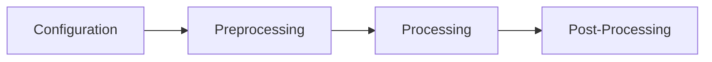

# RACEngine

**RACEngine** is a modular, modern game engine built with .NET 8 and C#. It serves as a learning platform and a foundation for developing custom games without relying on existing game engines. The project emphasizes clarity, separation of concerns, and practical elegance.

---

## 🚀 Features

* **Entity Component System (ECS):** A clean, idiomatic ECS implementation featuring `Entity`, `IComponent`, `World`, `ISystem`, and `SystemScheduler`.
* **Container System:** Intuitive APIs for spatial relationships with semantic distinction between containment (PlaceIn) and attachment (AttachTo) operations.
* **4-Phase Rendering Pipeline:** Distinct separation of configuration, preprocessing, processing, and post-processing phases for optimal performance and tool development.
* **Modular Architecture:** Each subsystem (e.g., AI, Animation, Audio, Assets) resides in its own project/folder, promoting scalability and maintainability.
* **Sample Games:** Multiple samples demonstrating engine capabilities including boid simulations, rendering effects, and the 4-phase pipeline architecture.

---

## 📁 Project Structure

```text
RACEngine/
├── src/
│   ├── Rac.ECS/            # Core ECS module
│   ├── Rac.Rendering/      # 4-phase rendering pipeline
│   ├── Rac.Engine/         # Engine orchestration and facade
│   ├── Rac.AI/             # AI subsystem
│   ├── Rac.Animation/      # Animation subsystem
│   ├── Rac.Audio/          # Audio subsystem
│   ├── Rac.Assets/         # Asset management
│   └── Rac.Core/           # Core utilities and extensions
└── samples/
    ├── SampleGame/         # Multiple game samples and demos
    └── TicTacToe/          # Simple turn-based game example
```

---

## 🎨 4-Phase Rendering Pipeline

RACEngine features a sophisticated rendering architecture that separates concerns into four distinct phases, enabling better performance, tool development, and maintainability.

### Architecture Overview



### Phase 1: Configuration
- **Purpose:** Pure data structures defining rendering behavior
- **Characteristics:** No GPU interaction, file I/O, or asset loading
- **Thread-safe:** Immutable configuration with built-in validation
- **Builder pattern:** Complex configuration construction support

```csharp
var config = RenderConfiguration.Create(new Vector2D<int>(1920, 1080))
    .WithPostProcessing(new PostProcessingConfiguration { EnableBloom = true })
    .WithQuality(new QualityConfiguration { MsaaSamples = 4 })
    .Build();
```

### Phase 2: Preprocessing
- **Purpose:** Asset loading, validation, and GPU resource compilation
- **One-time operation:** All expensive operations happen during initialization
- **Comprehensive validation:** Shaders, OpenGL capabilities, dependencies
- **Must complete before rendering:** Enforced by API design

### Phase 3: Processing
- **Purpose:** Fast GPU rendering operations for the main render loop
- **Performance focused:** No asset loading, compilation, or file I/O
- **Optimized state management:** Minimal overhead per frame
- **Main render loop:** Where vertex data becomes pixels

### Phase 4: Post-Processing
- **Purpose:** Screen-space effects applied after main rendering
- **Frame lifecycle:** Proper begin/finalize flow management
- **Configuration-driven:** Effects controlled by Phase 1 configuration
- **Effects include:** Bloom, tone mapping, HDR processing

### Benefits

✅ **Separation of Concerns:** Each phase has a single, clear responsibility  
✅ **Enforced Ordering:** Cannot render without completing preprocessing  
✅ **Performance:** Asset loading never blocks frame rendering  
✅ **Tool Integration:** Each phase can be controlled independently  
✅ **Extensibility:** New features fit clearly into appropriate phases  

### Usage in Engine

The engine automatically manages all four phases:

```csharp
// Happens once during initialization
renderer.Initialize(window);           // Phase 1: Configuration
renderer.InitializePreprocessing();    // Phase 2: Asset loading & validation
renderer.InitializeProcessing();       // Phase 3: GPU resource setup
renderer.InitializePostProcessing();   // Phase 4: Post-processing setup

// Happens every frame in the render loop
renderer.Clear();                      // Phase 3: Begin frame
renderer.UpdateVertices(vertices);     // Phase 3: Upload data
renderer.Draw();                       // Phase 3: Render geometry
renderer.FinalizeFrame();              // Phase 4: Apply effects & present
```

## 🛠️ Getting Started

### Prerequisites

* [.NET 8 SDK](https://dotnet.microsoft.com/download/dotnet/8.0)

### System Requirements

For optimal performance and full audiovisual effects support:

* **Graphics:** OpenGL 3.3 or higher
* **Audio:** OpenAL-compatible audio device (automatically handled by Silk.NET.OpenAL)
* **Required OpenGL Extensions:**
  - GL_ARB_framebuffer_object (for post-processing effects)
  - GL_ARB_texture_float (for HDR rendering)

**Note:** The engine will automatically detect your graphics and audio capabilities and gracefully fall back to basic rendering/no audio if requirements aren't met. Update your graphics drivers or use a newer graphics card for full visual effects support. Audio will use the NullAudioService as fallback if OpenAL initialization fails.

### Building the Engine

1. **Clone the repository:**

   ```bash
   git clone https://github.com/tomasforsman/RACEngine.git
   cd RACEngine
   ```

2. **Navigate to the sample game:**

   ```bash
   cd samples/SampleGame
   ```

3. **Build and run the sample game:**

   ```bash
   dotnet run
   ```

---

## 🧪 Sample Games

The repository includes multiple sample applications demonstrating different aspects of RACEngine:

### Available Samples

* **BoidSample:** Flocking simulation demonstrating ECS architecture, AI systems, and visual effects
* **ShooterSample:** Interactive shooter showcasing input handling and entity management
* **BloomTest:** HDR bloom effect demonstration highlighting post-processing capabilities
* **CameraDemonstration:** Interactive camera system with dual-camera rendering
* **RenderingPipelineDemo:** Educational demonstration of the 4-phase rendering pipeline
* **ContainerSample:** Container system demonstration with inventory management and equipment patterns

### Running Samples

Navigate to the sample game directory and run with specific sample names:

```bash
cd samples/SampleGame
dotnet run -- boidsample      # Default: Boid flocking simulation
dotnet run -- shootersample   # Interactive shooter
dotnet run -- bloomtest       # HDR bloom effects
dotnet run -- camerademo      # Camera system demonstration
dotnet run -- pipelinedemo    # 4-phase rendering pipeline demo
dotnet run -- containersample # Container system with inventory patterns
```

### Educational Features

Each sample includes:
* **Comprehensive commenting:** Educational explanations of game engine concepts
* **Container System Demonstrations:** Inventory management, equipment systems, and spatial organization
* **Multiple rendering modes:** Normal, SoftGlow, and Bloom shader effects
* **Interactive controls:** Keyboard and mouse input demonstrations
* **ECS showcases:** Component composition and system interactions
* **Graphics algorithms:** Implementation details with academic references

---

## 📚 Documentation

Comprehensive documentation is forthcoming. In the meantime, refer to the source code and the `SampleGame` project for insights into the engine's usage and capabilities.

---

## 🤝 Contributing

Contributions are welcome! If you're interested in contributing:

1. **Fork the repository.**
2. **Create a new branch:**

   ```bash
   git checkout -b feature/YourFeature
   ```
3. **Commit your changes:**

   ```bash
   git commit -m 'Add YourFeature'
   ```
4. **Push to the branch:**

   ```bash
   git push origin feature/YourFeature
   ```
5. **Open a pull request.**

Please ensure that your code adheres to the project's coding standards and includes appropriate tests.

---

## 📄 License

This project is licensed under the [MIT License](LICENSE).
---

## 📬 Contact

For questions, suggestions, or feedback:

* **Author:** Tomas Forsman
* **GitHub:** [@tomasforsman](https://github.com/tomasforsman)
* **Email:** [tomas@forsman.dev](mailto:tomas@forsman.dev)